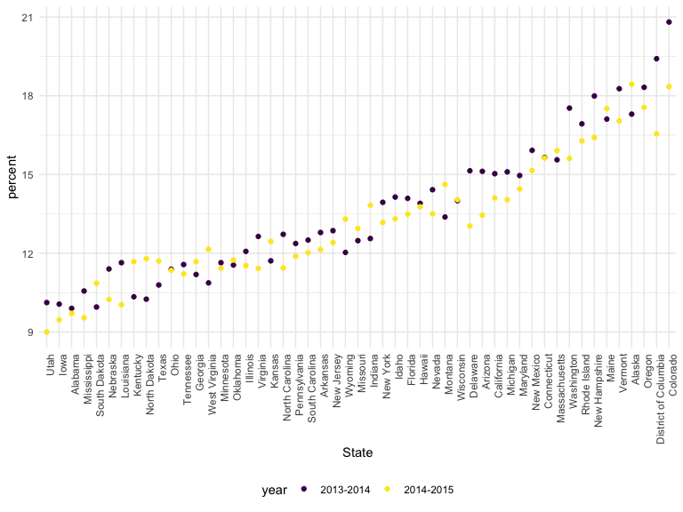
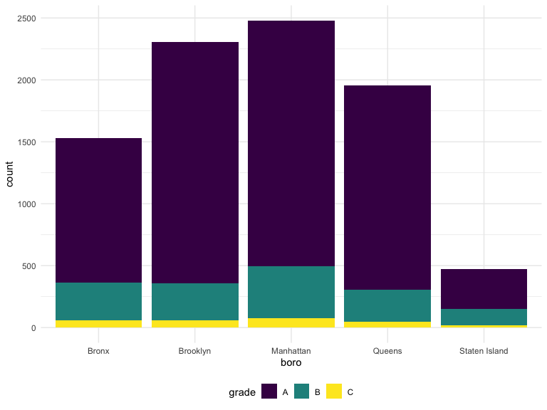
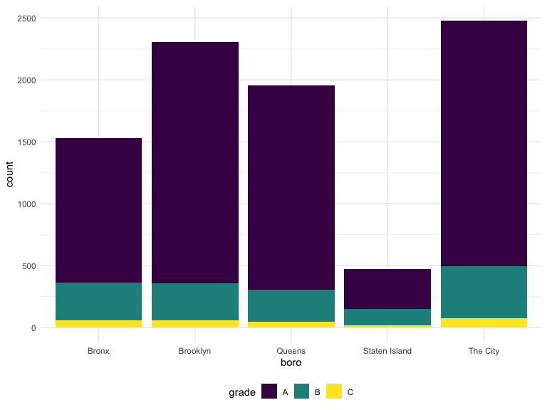
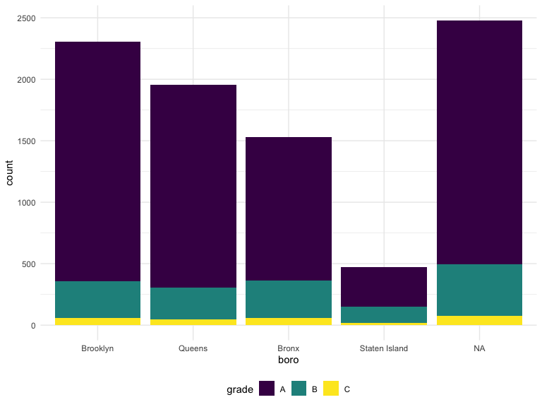
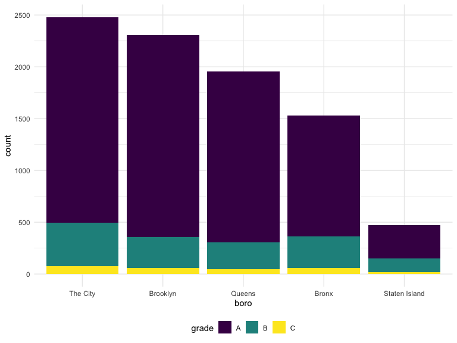
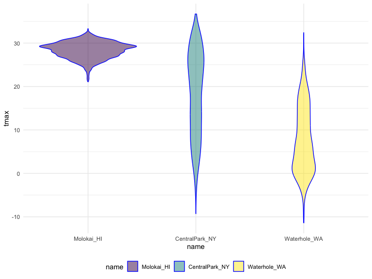
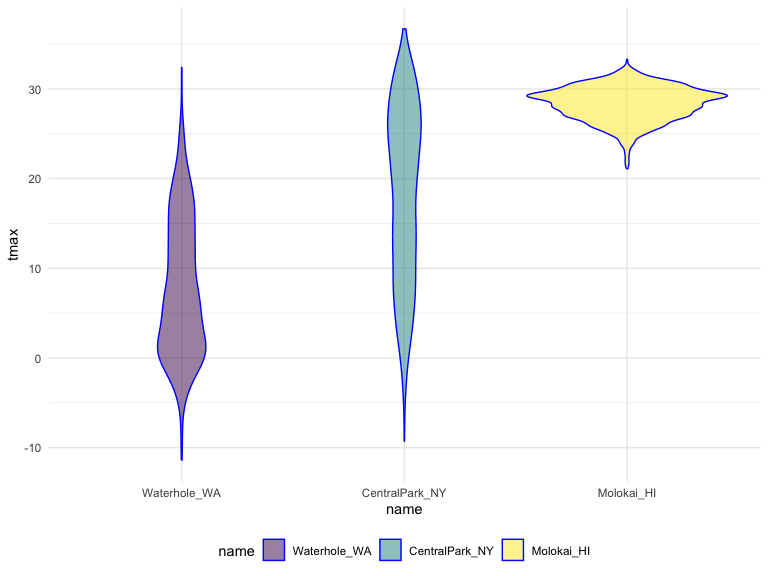

10.17-Data-Wrangling-II
================
Yuqing Liu
2023-10-17

``` r
library(rvest)
library(p8105.datasets)
library(stringr)
library(forcats)
library(dplyr)
```

    ## 
    ## Attaching package: 'dplyr'

    ## The following objects are masked from 'package:stats':
    ## 
    ##     filter, lag

    ## The following objects are masked from 'package:base':
    ## 
    ##     intersect, setdiff, setequal, union

``` r
library(tidyverse)
```

    ## ── Attaching core tidyverse packages ──────────────────────── tidyverse 2.0.0 ──
    ## ✔ ggplot2   3.4.3     ✔ readr     2.1.4
    ## ✔ lubridate 1.9.2     ✔ tibble    3.2.1
    ## ✔ purrr     1.0.2     ✔ tidyr     1.3.0

    ## ── Conflicts ────────────────────────────────────────── tidyverse_conflicts() ──
    ## ✖ dplyr::filter()         masks stats::filter()
    ## ✖ readr::guess_encoding() masks rvest::guess_encoding()
    ## ✖ dplyr::lag()            masks stats::lag()
    ## ℹ Use the conflicted package (<http://conflicted.r-lib.org/>) to force all conflicts to become errors

``` r
knitr::opts_chunk$set(
    echo = TRUE,
    warning = FALSE,
    fig.width = 8, 
  fig.height = 6,
  out.width = "90%"
)

theme_set(theme_minimal() + theme(legend.position = "bottom"))

options(
  ggplot2.continuous.colour = "viridis",
  ggplot2.continuous.fill = "viridis"
)


scale_colour_discrete = scale_colour_viridis_d
scale_fill_discrete = scale_fill_viridis_d
```

## String and manipulations

``` r
string_vec = c("my", "name", "is", "jeff")

str_detect(string_vec, "jeff")
```

    ## [1] FALSE FALSE FALSE  TRUE

``` r
str_replace(string_vec, "jeff", "Jeff")
```

    ## [1] "my"   "name" "is"   "Jeff"

``` r
# designate matches at the beginning or end of a line
string_vec = c(
  "i think we all rule for participating",
  "i think i have been caught",
  "i think this will be quite fun actually",
  "it will be fun, i think"
  )

str_detect(string_vec, "^i think")
```

    ## [1]  TRUE  TRUE  TRUE FALSE

``` r
str_detect(string_vec, "i think$")
```

    ## [1] FALSE FALSE FALSE  TRUE

``` r
string_vec = c(
  "Time for a Pumpkin Spice Latte!",
  "went to the #pumpkinpatch last weekend",
  "Pumpkin Pie is obviously the best pie",
  "SMASHING PUMPKINS -- LIVE IN CONCERT!!"
  )

str_detect(string_vec,"[Pp][Uu][Mm][Pp][Kk][Ii][Nn]") # either upper or lower case
```

    ## [1] TRUE TRUE TRUE TRUE

``` r
string_vec = c(
  '7th inning stretch',
  '1st half soon to begin. Texas won the toss.',
  'she is 5 feet 4 inches tall',
  '3AM - cant sleep :('
  )

str_detect(string_vec, "^[0-9][a-zA-Z]") # ^ begining
```

    ## [1]  TRUE  TRUE FALSE  TRUE

``` r
string_vec = c(
  'Its 7:11 in the evening',
  'want to go to 7-11?',
  'my flight is AA711',
  'NetBios: scanning ip 203.167.114.66'
  )

str_detect(string_vec, "7.11") # . anything in between
```

    ## [1]  TRUE  TRUE FALSE  TRUE

``` r
string_vec = c(
  'The CI is [2, 5]',
  ':-]',
  ':-[',
  'I found the answer on pages [6-7]'
  )

str_detect(string_vec, "\\[") # \\ special character
```

    ## [1]  TRUE FALSE  TRUE  TRUE

## Factors

``` r
vec_sex = factor(c("male", "male", "female", "female"))
vec_sex
```

    ## [1] male   male   female female
    ## Levels: female male

``` r
as.numeric(vec_sex)
```

    ## [1] 2 2 1 1

``` r
vec_sex = fct_relevel(vec_sex, "male") # relevel
vec_sex
```

    ## [1] male   male   female female
    ## Levels: male female

``` r
as.numeric(vec_sex)
```

    ## [1] 1 1 2 2

## NSDUH

``` r
nsduh_url = "http://samhda.s3-us-gov-west-1.amazonaws.com/s3fs-public/field-uploads/2k15StateFiles/NSDUHsaeShortTermCHG2015.htm"

table_marj = 
  read_html(nsduh_url) |> 
  html_table() |> 
  first() |>
  slice(-1) # delete first row

table_marj
```

    ## # A tibble: 56 × 16
    ##    State     `12+(2013-2014)` `12+(2014-2015)` `12+(P Value)` `12-17(2013-2014)`
    ##    <chr>     <chr>            <chr>            <chr>          <chr>             
    ##  1 Total U.… 12.90a           13.36            0.002          13.28b            
    ##  2 Northeast 13.88a           14.66            0.005          13.98             
    ##  3 Midwest   12.40b           12.76            0.082          12.45             
    ##  4 South     11.24a           11.64            0.029          12.02             
    ##  5 West      15.27            15.62            0.262          15.53a            
    ##  6 Alabama   9.98             9.60             0.426          9.90              
    ##  7 Alaska    19.60a           21.92            0.010          17.30             
    ##  8 Arizona   13.69            13.12            0.364          15.12             
    ##  9 Arkansas  11.37            11.59            0.678          12.79             
    ## 10 Californ… 14.49            15.25            0.103          15.03             
    ## # ℹ 46 more rows
    ## # ℹ 11 more variables: `12-17(2014-2015)` <chr>, `12-17(P Value)` <chr>,
    ## #   `18-25(2013-2014)` <chr>, `18-25(2014-2015)` <chr>, `18-25(P Value)` <chr>,
    ## #   `26+(2013-2014)` <chr>, `26+(2014-2015)` <chr>, `26+(P Value)` <chr>,
    ## #   `18+(2013-2014)` <chr>, `18+(2014-2015)` <chr>, `18+(P Value)` <chr>

``` r
data_marj = 
  table_marj |>
  select(-contains("P Value")) |> # remove p value
  pivot_longer(
    -State, # don't pivot longer for state
    names_to = "age_year", 
    values_to = "percent") |>
  separate(age_year, into = c("age", "year"), sep = "\\(") |>
  mutate(
    year = str_replace(year, "\\)", ""),
    percent = str_replace(percent, "[a-c]$", ""),
    percent = as.numeric(percent)) |>
  filter(!(State %in% c("Total U.S.", "Northeast", "Midwest", "South", "West")))

data_marj
```

    ## # A tibble: 510 × 4
    ##    State   age   year      percent
    ##    <chr>   <chr> <chr>       <dbl>
    ##  1 Alabama 12+   2013-2014    9.98
    ##  2 Alabama 12+   2014-2015    9.6 
    ##  3 Alabama 12-17 2013-2014    9.9 
    ##  4 Alabama 12-17 2014-2015    9.71
    ##  5 Alabama 18-25 2013-2014   27.0 
    ##  6 Alabama 18-25 2014-2015   26.1 
    ##  7 Alabama 26+   2013-2014    7.1 
    ##  8 Alabama 26+   2014-2015    6.81
    ##  9 Alabama 18+   2013-2014    9.99
    ## 10 Alabama 18+   2014-2015    9.59
    ## # ℹ 500 more rows

``` r
data_marj |>
  filter(age == "12-17") |> 
  mutate(State = fct_reorder(State, percent)) |> 
  ggplot(aes(x = State, y = percent, color = year)) + 
    geom_point() + 
    theme(axis.text.x = element_text(angle = 90, hjust = 1))
```


\## Restaurant inspections

``` r
data("rest_inspec")

rest_inspec |> 
  group_by(boro, grade) |> 
  summarize(n = n()) |> 
  pivot_wider(names_from = grade, values_from = n)
```

    ## `summarise()` has grouped output by 'boro'. You can override using the
    ## `.groups` argument.

    ## # A tibble: 6 × 8
    ## # Groups:   boro [6]
    ##   boro              A     B     C `Not Yet Graded`     P     Z  `NA`
    ##   <chr>         <int> <int> <int>            <int> <int> <int> <int>
    ## 1 BRONX         13688  2801   701              200   163   351 16833
    ## 2 BROOKLYN      37449  6651  1684              702   416   977 51930
    ## 3 MANHATTAN     61608 10532  2689              765   508  1237 80615
    ## 4 Missing           4    NA    NA               NA    NA    NA    13
    ## 5 QUEENS        35952  6492  1593              604   331   913 45816
    ## 6 STATEN ISLAND  5215   933   207               85    47   149  6730

``` r
rest_inspec =
  rest_inspec |>
  filter(grade %in% c("A", "B", "C"), boro != "Missing") |> 
  mutate(boro = str_to_title(boro)) # upper case for first character lower case following
```

``` r
rest_inspec |> 
  filter(str_detect(dba, "Pizza")) |> 
  group_by(boro, grade) |> 
  summarize(n = n()) |> 
  pivot_wider(names_from = grade, values_from = n)
```

    ## `summarise()` has grouped output by 'boro'. You can override using the
    ## `.groups` argument.

    ## # A tibble: 5 × 3
    ## # Groups:   boro [5]
    ##   boro              A     B
    ##   <chr>         <int> <int>
    ## 1 Bronx             9     3
    ## 2 Brooklyn          6    NA
    ## 3 Manhattan        26     8
    ## 4 Queens           17    NA
    ## 5 Staten Island     5    NA

``` r
rest_inspec |> 
  filter(str_detect(dba, "[Pp][Ii][Zz][Zz][Aa]")) |> 
  group_by(boro, grade) |> 
  summarize(n = n()) |> 
  pivot_wider(names_from = grade, values_from = n)
```

    ## `summarise()` has grouped output by 'boro'. You can override using the
    ## `.groups` argument.

    ## # A tibble: 5 × 4
    ## # Groups:   boro [5]
    ##   boro              A     B     C
    ##   <chr>         <int> <int> <int>
    ## 1 Bronx          1170   305    56
    ## 2 Brooklyn       1948   296    61
    ## 3 Manhattan      1983   420    76
    ## 4 Queens         1647   259    48
    ## 5 Staten Island   323   127    21

``` r
rest_inspec |> 
  filter(str_detect(dba, "[Pp][Ii][Zz][Zz][Aa]")) |>
  ggplot(aes(x = boro, fill = grade)) + 
  geom_bar() 
```



``` r
rest_inspec |> 
  filter(str_detect(dba, "[Pp][Ii][Zz][Zz][Aa]")) |>
  mutate(boro = fct_infreq(boro)) |> # reorder
  ggplot(aes(x = boro, fill = grade)) + 
  geom_bar() 
```


``` r
rest_inspec |> 
  filter(str_detect(dba, "[Pp][Ii][Zz][Zz][Aa]")) |>
  mutate(
    boro = fct_infreq(boro),
    boro = str_replace(boro, "Manhattan", "The City")) |>
  ggplot(aes(x = boro, fill = grade)) + 
  geom_bar() 
```



``` r
rest_inspec |> 
  filter(str_detect(dba, "[Pp][Ii][Zz][Zz][Aa]")) |>
  mutate(
    boro = fct_infreq(boro),
    boro = replace(boro, which(boro == "Manhattan"), "The City")) |>
  ggplot(aes(x = boro, fill = grade)) + 
  geom_bar()
```



``` r
rest_inspec |> 
  filter(str_detect(dba, regex("pizza", ignore_case = TRUE))) |>
  mutate(
    boro = fct_infreq(boro),
    boro = fct_recode(boro, "The City" = "Manhattan")) |>
  ggplot(aes(x = boro, fill = grade)) + 
  geom_bar()
```



\##Weather data

``` r
weather_df = 
  rnoaa::meteo_pull_monitors(
    c("USW00094728", "USW00022534", "USS0023B17S"),
    var = c("PRCP", "TMIN", "TMAX"), 
    date_min = "2021-01-01",
    date_max = "2023-12-31") |>
  mutate(
    name = recode(
      id, 
      USW00094728 = "CentralPark_NY", 
      USW00022534 = "Molokai_HI",
      USS0023B17S = "Waterhole_WA"),
    tmin = tmin / 10,
    tmax = tmax / 10) |>
  select(name, id, everything())
```

    ## Registered S3 method overwritten by 'hoardr':
    ##   method           from
    ##   print.cache_info httr

    ## using cached file: /Users/apple/Library/Caches/org.R-project.R/R/rnoaa/noaa_ghcnd/USW00094728.dly

    ## date created (size, mb): 2023-09-28 10:18:52.967797 (8.524)

    ## file min/max dates: 1869-01-01 / 2023-09-30

    ## using cached file: /Users/apple/Library/Caches/org.R-project.R/R/rnoaa/noaa_ghcnd/USW00022534.dly

    ## date created (size, mb): 2023-09-28 10:18:59.097334 (3.83)

    ## file min/max dates: 1949-10-01 / 2023-09-30

    ## using cached file: /Users/apple/Library/Caches/org.R-project.R/R/rnoaa/noaa_ghcnd/USS0023B17S.dly

    ## date created (size, mb): 2023-09-28 10:19:01.293988 (0.994)

    ## file min/max dates: 1999-09-01 / 2023-09-30

``` r
weather_df
```

    ## # A tibble: 3,009 × 6
    ##    name           id          date        prcp  tmax  tmin
    ##    <chr>          <chr>       <date>     <dbl> <dbl> <dbl>
    ##  1 CentralPark_NY USW00094728 2021-01-01   157   4.4   0.6
    ##  2 CentralPark_NY USW00094728 2021-01-02    13  10.6   2.2
    ##  3 CentralPark_NY USW00094728 2021-01-03    56   3.3   1.1
    ##  4 CentralPark_NY USW00094728 2021-01-04     5   6.1   1.7
    ##  5 CentralPark_NY USW00094728 2021-01-05     0   5.6   2.2
    ##  6 CentralPark_NY USW00094728 2021-01-06     0   5     1.1
    ##  7 CentralPark_NY USW00094728 2021-01-07     0   5    -1  
    ##  8 CentralPark_NY USW00094728 2021-01-08     0   2.8  -2.7
    ##  9 CentralPark_NY USW00094728 2021-01-09     0   2.8  -4.3
    ## 10 CentralPark_NY USW00094728 2021-01-10     0   5    -1.6
    ## # ℹ 2,999 more rows

``` r
table(weather_df$name)
```

    ## 
    ## CentralPark_NY     Molokai_HI   Waterhole_WA 
    ##           1003           1003           1003

``` r
weather_df |>
  mutate(name = forcats::fct_relevel(name, c("Molokai_HI", "CentralPark_NY", "Waterhole_WA"))) |> 
  ggplot(aes(x = name, y = tmax)) + 
  geom_violin(aes(fill = name), color = "blue", alpha = .5) + 
  theme(legend.position = "bottom")
```



``` r
weather_df |>
  mutate(name = forcats::fct_reorder(name, tmax)) |> 
  ggplot(aes(x = name, y = tmax)) + 
  geom_violin(aes(fill = name), color = "blue", alpha = .5) + 
  theme(legend.position = "bottom")
```



``` r
weather_df |>
  lm(tmax ~ name, data = _)
```

    ## 
    ## Call:
    ## lm(formula = tmax ~ name, data = weather_df)
    ## 
    ## Coefficients:
    ##      (Intercept)    nameMolokai_HI  nameWaterhole_WA  
    ##            18.26             10.11            -10.51

``` r
weather_df |>
  mutate(name = forcats::fct_relevel(name, c("Molokai_HI", "CentralPark_NY", "Waterhole_WA"))) |> 
  lm(tmax ~ name, data = _)
```

    ## 
    ## Call:
    ## lm(formula = tmax ~ name, data = mutate(weather_df, name = forcats::fct_relevel(name, 
    ##     c("Molokai_HI", "CentralPark_NY", "Waterhole_WA"))))
    ## 
    ## Coefficients:
    ##        (Intercept)  nameCentralPark_NY    nameWaterhole_WA  
    ##              28.37              -10.11              -20.63
